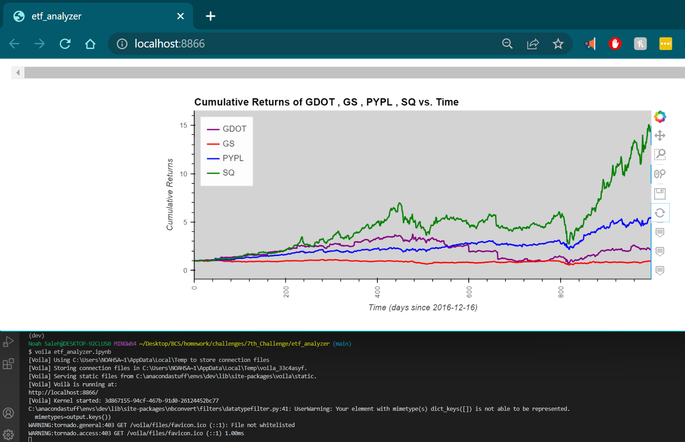

# 7th_Challenge

## Summary of Purpose  

This is not a program. 
This is just an analysis of an ETF.  
I didn't come to any conclusions as to which stock to invest in, however. I mainly just did this challenge for SQL practice.

---

## Required/Compatible Technologies

**Compatible OS's:** Mac, Windows, or Linux  
**Programming language:** SQL & Python inside of Jupyter Lab  
**Required libraries:** numpy, pandas, hvplot.pandas, sqlalchemy, AND %matplotlib inline. Using the Voila library is optional.

Using a conda environment from anaconda is preferable.

To view it, download the repository & open it with Jupyter Lab or some program that can run .ipynb files (e.g. VS Code using some extensions/add-ons). The cells should have already been run. If some haven't been run, then restart the kernel and run all the cells.

If you just want to see the outputs, you could alternatively run the notebook as a local web-application using the voila library. To do this, open your terminal, cd into the file location where you have stored my work. Then run the following command: `voila etf_analyzer.ipynb`

  

---

## Contributors

Noah Saleh

email: noahgsaleh@gmail.com

---

